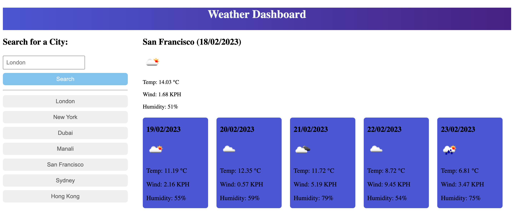

# weather-searcher

## Description 

This aims of this project are to create a site which will fetch the weather and a 5-day forecast, from the users search input, then dynamically render the results on cards. User search history is stored in local storage, then used to generate buttons, which can be used to fetch the forecast by clicking them.

The process was very educational, and tested my html, CSS, and JS skills. This has improved my understanding of several key feature of JS in particular the use of local storage and array methods.

The code has been written with consideration given to future usage, therefore multiple functions were created which can be modified, or used to solve future projects with similar requirements. 

## Link to deployed site

Please check out the deployed [JavaScript project](https://stuart540.github.io/weather-searcher/)

## Usage 

This page is intended to run in the browser, with no installation. The search history is stored into the users local storage.

## License

This project is licensed under the standard MIT license